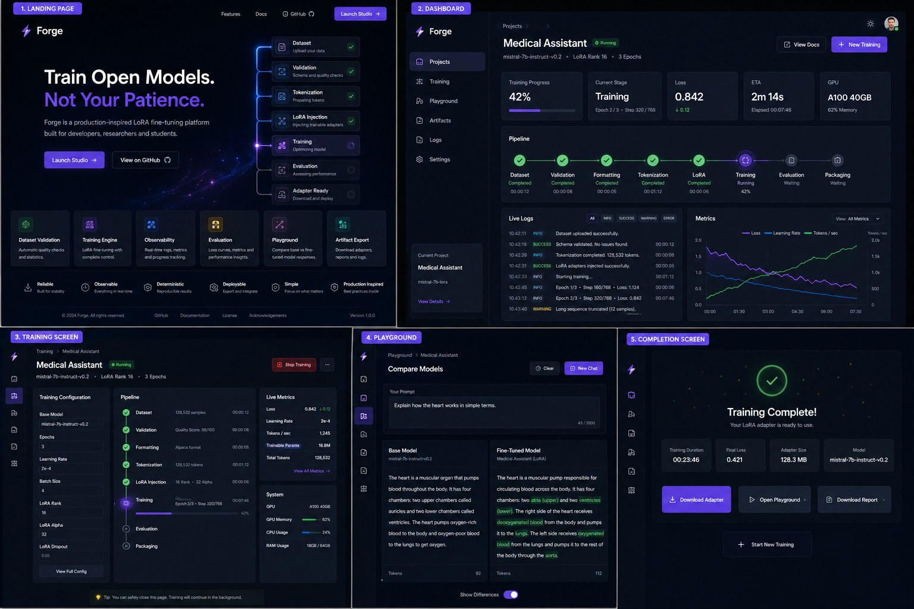

# Forge

> **Reliable AI Fine-Tuning** — A production-inspired LoRA engineering platform built for developers, researchers, and students.

<p align="center">
  
</p>

---

## Why Forge

Fine-tuning language models should be reliable, observable, and reproducible. Forge is not another AI demo — it is a platform that demonstrates how production AI software should be engineered.

Every stage of the fine-tuning pipeline is observable, validated, and logged. The user always knows what the application is doing, what it will do next, and how long it will take.

**Forge is evidence that its engineer understands:**

- Professional software engineering
- Modern frontend architecture
- Backend engineering
- Developer experience
- Containerization
- Observability
- ML platform engineering

---

## Features

- **Dataset Validation** — Automatically detect duplicates, empty fields, and schema errors before training begins.
- **Reliable Training** — LoRA fine-tuning pipeline with checkpoint persistence and deterministic execution.
- **Live Observability** — Stream logs, metrics, and progress updates in real time — no page refresh required.
- **Evaluation** — Loss curves, token statistics, and comprehensive training summaries at your fingertips.
- **Artifact Export** — Download adapters, configs, metrics, and training reports in one click.
- **Model Playground** — Compare base and fine-tuned model outputs side by side directly in the browser.

---

## Architecture

Forge consists of four logical layers:

```
                        Browser
                           │
             Next.js + Tailwind + shadcn/ui
                           │
                   REST + Server Sent Events
                           │
                    FastAPI Application
                           │
      ┌────────────────────┼────────────────────┐
      │                    │                    │
      ▼                    ▼                    ▼
 Dataset Engine      Training Engine     Inference Engine
      │                    │                    │
      └────────────────────┼────────────────────┘
                           │
                Transformers + PEFT + TRL
                           │
                    HuggingFace Models
```

### Design Philosophy

- **No microservices.** A single, well-structured backend.
- **No unnecessary abstractions.** Every file has one clear responsibility.
- **Observable by default.** Every operation emits structured logs and progress.
- **Deterministic pipelines.** Same input → same output. Always.

---

## Quick Start

### Prerequisites

- **Docker** and **Docker Compose** (recommended)
- Or: **Node.js 22+** and **Python 3.11+**

### Option 1: Docker (Recommended)

```bash
# Clone the repository
git clone https://github.com/your-org/forge.git
cd forge

# Start the application
docker compose up
```

The application starts at:

| Service  | URL                      |
| -------- | ------------------------ |
| Frontend | `http://localhost:3000`  |
| Backend  | `http://localhost:8000`  |
| API Docs | `http://localhost:8000/docs` |
| Health   | `http://localhost:8000/health` |

### Option 2: Local Development

```bash
# Configure environment
cp .env.example .env

# Backend
cd backend
python -m venv .venv
source .venv/bin/activate  # or .venv\Scripts\Activate.ps1 on Windows
pip install -r requirements.txt
python -m uvicorn app.main:app --reload --port 8000

# Frontend (separate terminal)
cd frontend
npm install
npm run dev
```

---

## Repository Structure

```
forge/
├── .claude/                    # Claude Code configuration
│   └── CLAUDE.md
├── .github/
│   └── workflows/
│       └── ci.yml              # CI pipeline
├── docs/                       # Engineering documentation
│   ├── 00_Vision.md
│   ├── 01_PRD.md
│   ├── 02_Architecture.md
│   ├── 04_Engineering_Constitution.md
│   ├── 05_Implementation_Plan.md
│   ├── 06_TASKS.md
│   └── 07_MASTER_IMPLEMENTATION.md
├── frontend/                   # Next.js 15 application
│   ├── app/                    # App router pages
│   │   ├── studio/             # Studio dashboard & pages
│   │   ├── layout.tsx          # Root layout
│   │   └── page.tsx            # Landing page
│   ├── components/             # React components
│   │   ├── landing/            # Landing page components
│   │   ├── studio/             # Studio components
│   │   └── ui/                 # shadcn/ui primitives
│   ├── hooks/                  # Custom React hooks
│   ├── lib/                    # Utilities & API client
│   ├── types/                  # TypeScript type definitions
│   ├── public/                 # Static assets
│   ├── Dockerfile
│   └── package.json
├── backend/                    # FastAPI application
│   ├── app/
│   │   ├── api/                # HTTP routes & middleware
│   │   ├── core/               # Config, logging, lifecycle
│   │   ├── schemas/            # Pydantic request/response models
│   │   ├── services/           # Business logic orchestration
│   │   ├── utils/              # Pure helper functions
│   │   └── main.py             # Application entry point
│   ├── requirements.txt
│   └── Dockerfile
├── assets/                     # Project images & screenshots
├── docker-compose.yml
├── .env.example
├── .gitignore
├── LICENSE
└── README.md
```

---

## Technology Stack

### Frontend

| Technology      | Purpose                          |
| --------------- | -------------------------------- |
| Next.js 15      | React framework                  |
| TypeScript      | Type-safe JavaScript             |
| Tailwind CSS    | Utility-first CSS                |
| shadcn/ui       | Accessible component primitives  |
| Framer Motion   | Declarative animations           |
| Lucide React    | Consistent icon library          |
| React Hook Form | Form state management            |
| Zod             | Schema validation                |
| Geist           | Professional typeface by Vercel  |

### Backend

| Technology       | Purpose                       |
| ---------------- | ----------------------------- |
| Python 3.11      | Runtime                       |
| FastAPI           | Async web framework           |
| Pydantic          | Data validation               |
| Uvicorn           | ASGI server                   |
| Structlog         | Structured logging            |

### Infrastructure

| Technology       | Purpose                       |
| ---------------- | ----------------------------- |
| Docker           | Containerization              |
| Docker Compose   | Multi-service orchestration   |
| GitHub Actions   | Continuous integration        |

---

## Roadmap

### ✓ Sprint 0 — Foundation (Complete)

- [x] Repository structure & configuration
- [x] FastAPI backend with health endpoint
- [x] Next.js frontend with dark theme
- [x] Landing page with animated pipeline
- [x] Studio shell with navigation
- [x] Docker Compose
- [x] GitHub Actions CI
- [x] Structured logging
- [x] README & documentation

### Sprint 1 — Dataset Engine (Next)

- [ ] JSONL upload endpoint
- [ ] Schema validation
- [ ] Duplicate detection
- [ ] Token estimation
- [ ] Dataset quality report

### Sprint 2 — Training Engine

- [ ] Model loading (transformers + PEFT)
- [ ] LoRA injection & configuration
- [ ] Training pipeline
- [ ] Checkpoint persistence
- [ ] Metrics collection

### Sprint 3 — Observability

- [ ] Server-Sent Events streaming
- [ ] Live logs & progress
- [ ] Training state machine
- [ ] ETA estimation

### Sprint 4 — Evaluation

- [ ] Loss visualization
- [ ] Training summaries
- [ ] Adapter verification

### Sprint 5 — Playground

- [ ] Base model inference
- [ ] Fine-tuned inference
- [ ] Side-by-side comparison

### Sprint 6 — Artifact Management

- [ ] Adapter packaging
- [ ] Report generation
- [ ] Bulk downloads

---

## Design

Forge draws inspiration from professional engineering tools:

- **Linear** — Task management that feels fast and intentional.
- **Vercel** — Clean, spacious interfaces focused on developer workflows.
- **Cursor** — AI-native design that stays out of the way.

### Theme

- **Dark-first** design with an optional light mode.
- Professional blue accent (`#3b82f6`).
- Geist typeface by Vercel for clean, readable typography.
- Lucide icons for consistent, minimal iconography.
- Framer Motion for subtle, communicative animations.

---

## Engineering Standards

Forge follows a strict engineering constitution:

- **Reliability over cleverness.**
- **Simplicity over abstraction.**
- **Explicitness over magic.**
- **Maintainability over speed.**
- **Deterministic behavior over hidden behavior.**

Every error includes a title, description, root cause, recommendation, and recoverability flag. Raw stack traces are never shown to users.

Every long-running operation emits structured logs with timestamps, levels, component names, stages, and metadata.

---

## Contributing

Forge is a personal engineering portfolio project and is not currently accepting external contributions. However, the repository is designed to be understandable and maintainable by any engineer who clones it.

Guidelines:
1. Read `docs/04_Engineering_Constitution.md` first.
2. Follow the architecture defined in `docs/02_Architecture.md`.
3. Implement only one task at a time, per `docs/06_TASKS.md`.
4. Never redesign the architecture.
5. Never expand scope beyond the current milestone.

---

## License

MIT License. See [LICENSE](./LICENSE) for details.

---

## Acknowledgments

Forge is built on the shoulders of excellent open-source projects:

- [HuggingFace Transformers](https://github.com/huggingface/transformers)
- [PEFT](https://github.com/huggingface/peft)
- [FastAPI](https://github.com/fastapi/fastapi)
- [Next.js](https://github.com/vercel/next.js)
- [shadcn/ui](https://ui.shadcn.com)
- [Tailwind CSS](https://github.com/tailwindlabs/tailwindcss)
- [Lucide](https://lucide.dev)
- [Framer Motion](https://www.framer.com/motion)

---

<p align="center">
  <em>Built with engineering discipline. Designed for trust.</em>
</p>
